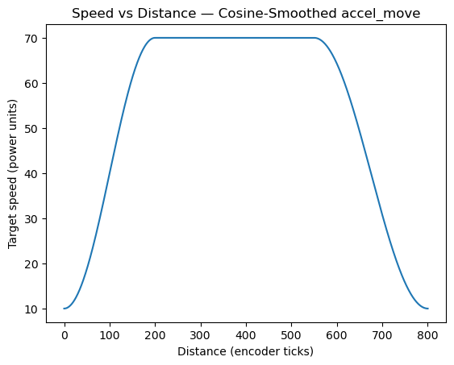
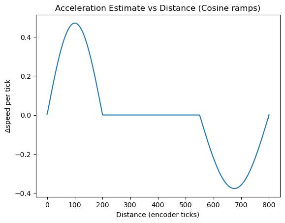
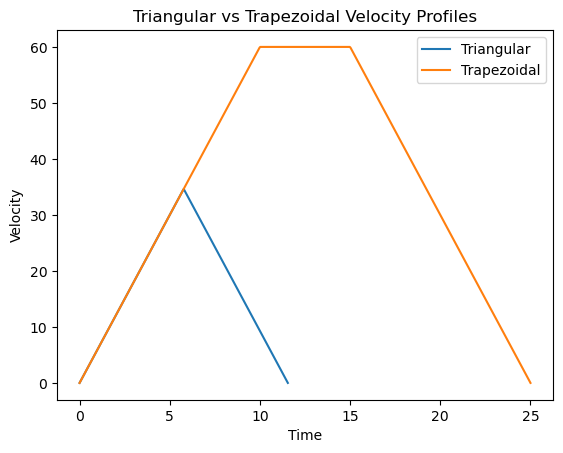
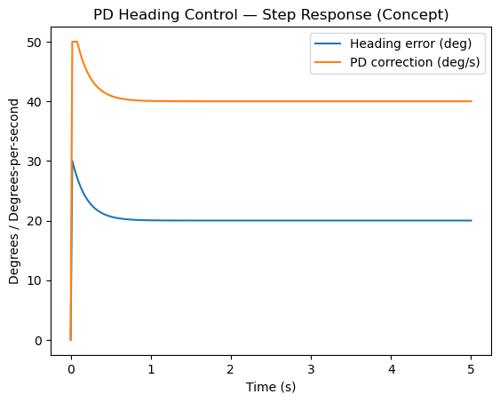

# KZmotion — Core Motion & Control Library (WRO/EV3-style)

I decided to **open-source my core motion library** used across RoboSports prep and matches.  
This repo keeps the essentials: **line following, gyro-stabilized straight & turns, cosine-smoothed ramps, encoder-based distance control, color/compass utilities**. The goal is to help teams plug-and-play and tune faster.

---

## Highlights

- **Dual-sensor line following** with a **PD** controller (`kp`, `kd`) and smooth speed ramp (`SmoothSpeed`).
- **Line events**: stop at **T/X intersections** (`LineT`, `LineX`); snap **left/right** onto a line (`LineLeft`, `LineRight`).
- **Distance control** by **encoders**: absolute/relative (`LineEncoder`, `LineEncoder2`, `vpered`, `nazad`, single-wheel `SoloL/SoloR`).
- **Gyro-based control**: keep heading while driving (`GyroStraight`), **turn by angle** with slowdown (`GyroTurn`).
- **Cosine-smoothed motion**: `accel_move` / `accel_move_back` implement **S-shaped ramps** (jerk-limited feel) within a **triangular/trapezoidal** profile.
- **Curved arcs** by radius/angle (`Arc`), basic **ultrasonic approach** (`MoveToObject`).
- **Calibration helpers**: color sensors (`CalibrateColorSensors`), simple compass/gyro variants (`CompasEncoder*`, `compasT*`).

> The library is **portable** across block/visual IDEs used in WRO contexts. Functions map to B/C drive motors, typical color sensors, gyro/compass ports.

---

## Quick Start

1. **Choose base**: call one of `LargeBase()` / `MiddleBase()` / `MiddleBase2()` to set motor directions `kB/kC`.
2. **Set speed**: `speed = 30` (or your target).  
3. **Calibrate**: run `CalibrateColorSensors(...)` to get black/white and set your threshold.  
4. **Drive**: pick your primitive — e.g., `LineEncoder(180)`, `GyroStraight(port=2, distance=600, targetAngle=0)`, or  
   `accel_move(total=800, accel=200, decel=250, minSpeed=10, maxSpeed=70)`.
5. **Stop** safely: `SmoothStop()` or `StopPower()` after maneuvers.

---

## Tuning (PD / Motion)

- **Line PD**: `kp=0.8`, `kd=2.0` worked as a baseline; **`ki=0`** (deliberately unused).  
- **Alignment PD**: `kp_align=3`, `kd_align=6` for straight moves and encoder balancing.  
- **Gyro PD**: inside `GyroStraight` the defaults are `kp_gyro=2`, `kd_gyro=5` with correction clamp (±50).  
- **Speed ramps**: `accel_move` uses **cosine easing** for accel/decel → jerk-limited S-feel; see the plots below.

> Tip: Start with low gains → increase `kp` until you get crisp tracking, then add `kd` to suppress overshoot. Keep integral off for line/heading tasks.

---

## Concept Plots

These are **illustrations** of how the library moves/controls. If you put the images into `assets/`, the links will work:

- **Cosine-smoothed accel/decel** (speed vs distance):  
  
- **Acceleration smoothness** (finite difference):  
  
- **Triangular vs trapezoidal velocity profiles**:  
  
- **PD heading step response (concept)**:  
  

---

## API Cheatsheet (most used)

```text
# Base & checks
LargeBase() / MiddleBase() / MiddleBase2()
Check()

# Line following
reg()                       # PD on dual line sensors (ports 1 & 2 by default)
LineT() / LineX()           # stop at T/X intersections
LineLeft() / LineRight()    # snap onto a line by turning

# Distance / time
LineEncoder(DestEnc) / LineEncoder2(DestEnc)
LineTime(ms)
vpered(DestEnc) / nazad(DestEnc)      # straight fwd/back with encoder alignment
SoloL(spd, DestEnc) / SoloR(spd, DestEnc)

# Gyro / Compass
GyroStraight(port, distance, targetAngle)
GyroTurn(port, targetAngle)
CompasEncoder1(DestEnc, angle) / CompasEncoder2(DestEnc)

# Motion profiles
accel_move(total, accel, decel, minSpeed, maxSpeed)
accel_move_back(total, accel, decel, minSpeed, maxSpeed)
accel_turn_wheel(totalAngle, accelAngle, decelAngle, minSpeed, maxSpeed, direction)

# Geometry & sensors
Arc(radius, angle)
MoveToObject(ultrasonic_port, targetDistance)
CalibrateColorSensors(blackValue, whiteValue)

# Display / UX
LCD_int(x) / LCD_str(s); WaitButton(key)
```

---

## Port Map (defaults you can change)

* **Motors**: `B` = left, `C` = right (via base functions this can flip with gearboxes).
* **Line sensors**: ports `1` and `2` (percent mode).
* **Color sensor (RGBW)**: port `4`.
* **Gyro**: port `2` or `3` depending on function.
* **Compass/Magnetometer**: port `3` (in `Compas*` helpers).

---

## Safety & Field Notes

* Clamp power and corrections if your drivetrain skids.
* Re-run **gyro reset** on each run if drift is noticeable.
* Re-calibrate color if lighting changes.
* Test ramps with **lower `maxSpeed`** first, then scale up.
* Log: encoder deltas, PD output, heading → catches 90% of tuning issues.

---
